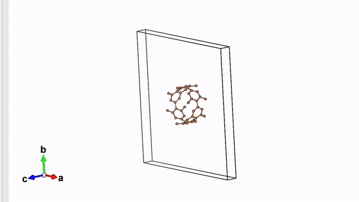

I created a web-based tool for generating CNT (carbon nanotube) structures in VASP POSCAR format. The generated coordinates can be saved as a `.vasp` file and visualized directly in VESTA.

A CNT can be understood as a graphene sheet rolled into a cylinder, producing the familiar cylindrical honeycomb structure shown above. The generated structures also include vacuum around the tube so that they can be used directly in periodic VASP calculations.

## Why I Built It

I tried several existing structure-generation tools but found a few recurring issues:

- Some required manual geometric calculations.
- Others required local installation or command-line setup.
- Input options were often more complicated than necessary for simple CNT generation.
- I wanted a lightweight tool that could generate a structure directly in the browser.

This led me to build a simple web-based generator that automates the geometry and minimizes the number of required inputs.

## Features

### No Installation Required

The generator runs entirely in the browser using JavaScript, so no local installation is required. It can be used across different operating systems.

### Simple Input

The main input is the number of carbon hexagons around the tube circumference. Users can also adjust the C-C bond length and change the atomic species if needed.

Both armchair and zigzag CNT structures are supported.

## How to Use It

Try the generator here:

[Open CNT Generator ↗](https://suecreamm.github.io/cnt_generator/)

Choose either an **armchair** or **zigzag** structure, set the desired value of \(N\), and generate the structure. The resulting atomic coordinates are provided in VASP POSCAR format.

Example structures for several values of \(N\) are also available here:

[View example structures on GitHub ↗](https://github.com/suecreamm/materials/tree/main/02CNT)

The generated output can be saved as a `.vasp` file and opened in [VESTA](https://jp-minerals.org/vesta/en/download.html) for 3D visualization.

## Development Story

I started this project because I wanted a lightweight structure-generation tool that would work consistently across different operating systems.

Rather than relying on a Python environment or terminal-based workflow, I used JavaScript so that the entire process could run directly in a web browser.

The geometric relations for the CNT coordinates were implemented using cylindrical coordinates, and the first working version took about a week to develop.

## References & Resources

- Atomic structures: based on standard CNT geometry
- Coordinate generation: implemented using cylindrical-coordinate relations
- Frontend design: [HTML5 UP – Solid State](https://html5up.net/solid-state)
- Source code: [GitHub repository ↗](https://github.com/suecreamm/cnt_generator)